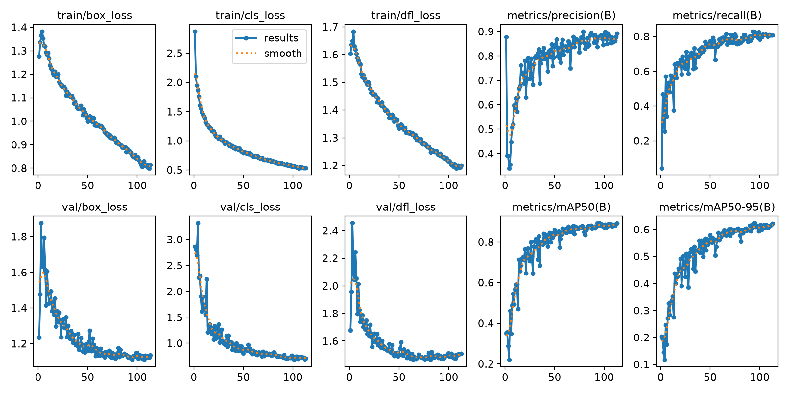

# R76S YOLO 垃圾分类检测客户端

[](https://github.com/hhui53758-cloud/R76S-YOLO-Client/actions/workflows/checks.yml)
[](https://github.com/hhui53758-cloud/R76S-YOLO-Client/releases/latest)

[下载 Windows 客户端](https://github.com/hhui53758-cloud/R76S-YOLO-Client/releases/latest) · [普通用户说明](windows_client/用户使用说明.md) · [训练入口](training/README.md) · [数据集来源](training/DATASET.md) · [反馈问题](https://github.com/hhui53758-cloud/R76S-YOLO-Client/issues)

一个 Windows 图形客户端，同时支持本机 ONNX 推理与 NanoPi R76S 的 RK3576 NPU 推理。普通使用者可以下载便携版；开发者可以克隆源码运行、修改和打包。

支持四类：可回收物、有害垃圾、厨余垃圾、其他垃圾。模型存在误报和泛化局限，项目用于学习和演示，不应将检测结果当作可靠的垃圾处置建议。

## 功能

- 图片、文件夹、视频、Windows 摄像头检测。
- 文件夹批量处理、中文标注、CSV（Comma-Separated Values，逗号分隔值）导出、处理后 MP4 视频保存。
- 置信度与 IoU（Intersection over Union，交并比）调整、清空画面、保存结果和用户设置。
- R76S 图片推理、板端 USB 摄像头和 Windows/R76S 同图对比。
- 自动模式在 R76S 不可用时回退到 Windows 本机。
- Windows 网络切换工具，支持校园网认证期间保留 Wi-Fi 上网。

## 快速开始：只用 Windows

普通用户从 [Releases 下载页](https://github.com/hhui53758-cloud/R76S-YOLO-Client/releases/latest) 下载 `R76S-YOLO-Client-Windows-x64.zip`，完整解压后双击 `R76S-YOLO-Client.exe`。必须保留旁边的 `_internal` 文件夹。GitHub 的 Source code ZIP 是源码，不是便携运行包。

开发者安装 Windows 64 位 Python 3.11 或 3.12（包含 Tkinter 和 Python Launcher），在仓库根目录执行：

```powershell
py -3 -m venv .venv
.\.venv\Scripts\python.exe -m pip install -r windows_client\requirements.txt
.\.venv\Scripts\python.exe windows_client\app.py
```

也可以依次双击 `windows_client/install_windows_client.bat` 和 `windows_client/run_client.bat`。仓库已包含模型，不需要原作者的 F 盘、训练环境或 R76S。

## 接入 R76S

已部署好的同一台 R76S 只需接电、接 LAN 网线和摄像头，客户端即可连接，不需要重新安装板端环境。新设备先按照 [板端部署说明](docs/DEPLOY_R76S.md) 安装。

默认配置：电脑有线 `192.168.137.1/24`，R76S `192.168.137.47/24`，服务端口 `8765`。电脑 Wi-Fi 用于互联网，有线用于 R76S。

自定义地址可以通过环境变量设置，例如：

```powershell
$env:R76S_SERVER_URL = "http://192.168.1.50:8765"
.\.venv\Scripts\python.exe windows_client\app.py
```

自定义本地模型可使用 `R76S_MODEL_PATH`。模型必须符合 [模型契约](deploy/model_manifest.json)，普通 YOLO 导出的单输出 ONNX 不适用。

## 项目结构

```text
windows_client/       图形界面、双端后端、网络工具和测试
deploy/               模型、模型契约、R76S 服务和安装脚本
training/             训练入口、历史参数与真实指标、数据来源
docs/                 使用、架构、网络、部署和发布文档
scripts/              可移植打包与项目检查工具
licenses/             随附第三方许可证
.github/workflows/    自动源码检查与本机推理测试
```

ONNX（Open Neural Network Exchange，开放神经网络交换格式）用于 Windows；RKNN 是 Rockchip 的神经网络模型格式，供板端 NPU（Neural Processing Unit，神经网络处理器）使用。两者来自同一训练模型，但量化后结果可能不同。

## 验证与打包

```powershell
.\.venv\Scripts\python.exe scripts\check_project.py
.\.venv\Scripts\python.exe windows_client\smoke_test.py
.\.venv\Scripts\python.exe windows_client\workflow_test.py
.\.venv\Scripts\python.exe windows_client\remote_backend_test.py
.\.venv\Scripts\python.exe -m pip install -r requirements-build.txt
.\.venv\Scripts\python.exe scripts\build_windows.py
```

输出为 `dist/R76S-YOLO-Client/` 和 `release/R76S-YOLO-Client-Windows-x64.zip`。大安装包作为 GitHub Release 附件分发，避免反复提交到源码历史。

## 更多说明

- [面向普通用户的使用说明](windows_client/用户使用说明.md)
- [架构与日常使用](docs/ARCHITECTURE.md)
- [板端 HTTP 接口](docs/API.md)
- [从零部署](docs/DEPLOY_R76S.md)
- [网络切换与校园网认证](docs/NETWORK.md)
- [上传 GitHub 和发布](docs/PUBLISH_GITHUB.md)
- [第三方来源和许可状态](THIRD_PARTY_NOTICES.md)
- [训练与复现限制](training/README.md)
- [数据集来源、划分与许可](training/DATASET.md)
- [参与开发](CONTRIBUTING.md)

## 数据与许可

训练数据来源由项目作者确认是 [Keai Xiao 的 Roboflow waste](https://universe.roboflow.com/keai-xiao-zwt9l/waste-8vlsn)，来源页标注 CC BY 4.0（Creative Commons Attribution 4.0，知识共享署名 4.0）。本地使用 2743 张，来源页为 2739 张，历史版本和差额尚待核对；详见数据说明与检查报告。先通过来源页获取数据，不将未追溯差异的本地快照当作上游原版发布。

本仓库包含约 27 MB 的三份部署模型、训练脚本与历史记录；不包含训练图片、个人照片、设备密钥、日志、系统镜像和运行环境。数据集许可与训练框架、模型、原创客户端代码的许可分别处理。原创代码许可证尚待作者选择，没有擅自将整个项目设成 MIT 或 Apache-2.0。

## 历史训练表现

标准 YOLO11n 历史记录共 113 轮，按验证集 mAP50-95 排序，第 95 轮最高：Precision 0.87424、Recall 0.82434、mAP50 0.89297、mAP50-95 0.62386。这是单次历史验证结果，不是独立测试成绩或实际摄像头性能保证。发现一组训练/验证跨组重复图片，原始划分暂未修改；[完整记录与局限](training/HISTORICAL_RESULTS.md)。


